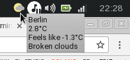

# go-weather-indicator
Minimalistic GTK weather indicator written in GoLang. Uses [Weatherbit](https://www.weatherbit.io) as provider. 

You can get yout free API key here: https://www.weatherbit.io/account/create

This application relies on https://github.com/mattn/go-gtk for the GTK bindings and I quickly wrote one for Weatherbit provider (https://github.com/guitmz/go-weatherbit) and this last one has a lot of room for improvements.

# Installation
Either download the binary release from GitHub or run:

`$ go get -u "github.com/guitmz/go-weather-indicator"`

You are required to install `gdk-pixbuf` and `gtk2` in order to run this properly.

# Usage
`$ go-weather-indicator --city Berlin --country Germany --key API_KEY`

# TODO
- More weather information
- Better error handling
- Try to cleanup and add comments in the code
- Write tests
- Allow more customization like displaying temeprature in Farenheit

